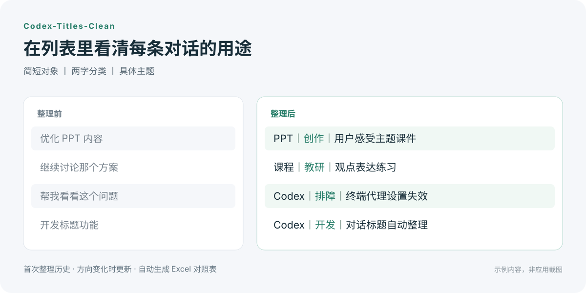
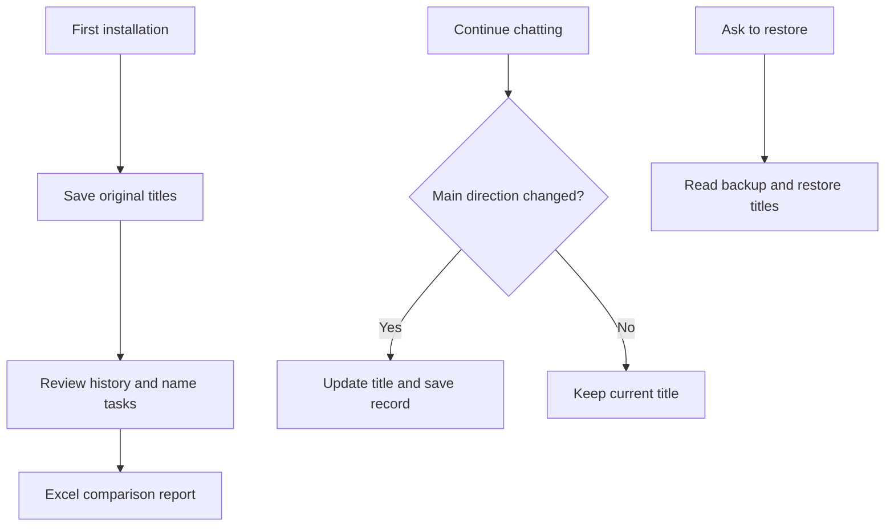

# Codex-Titles-Clean

[简体中文](README.md) · **English**

[](LICENSE)   [](https://github.com/JASONWONG1124/Codex-Titles-Clean/stargazers)

**Turn vague, inconsistent Codex titles into a history you can find your way around.**

As tasks pile up, similar titles make old work hard to find. A conversation can also move on while its title still describes the original topic. Codex-Titles-Clean organizes your existing history and keeps titles useful as your work changes.

- **Clean up existing history.** Automatically review all accessible local Codex tasks, including archived tasks, and name them by what they are about.
- **Get an Excel comparison report.** See each task's ID, original title, new title, and processing result in one file.
- **Keep titles useful as you chat.** Update when the main direction changes; keep the title stable for ordinary follow-up questions.
- **Restore titles when needed.** Original titles are saved locally. Mention the plugin to restore one task's original title or undo the initial history cleanup.



*Illustrative examples, not a screenshot of the app. The plugin changes title text; it does not change the sidebar's layout or appearance.*

Titles follow `short subject 丨 two-character category 丨 specific topic`, for example:

```text
PPT丨讨论丨演示的信息密度
PPT丨创作丨用户感受主题课件
```

The category is exactly two Chinese characters, with an open vocabulary based on the conversation. The examples show a task moving from discussing presentation density to creating course slides. Documentation is available in English; generated titles and report headers currently follow the Chinese format.

## Install and get your first report

You need **macOS**, **Python 3.9+**, and a signed-in **Codex desktop app** with plugin and Hook support. Initial cleanup needs an internet connection and available Codex model usage. No additional Python packages or Excel installation are required.

### Option 1: let Codex install it (recommended)

1. [Download the source ZIP](https://github.com/JASONWONG1124/Codex-Titles-Clean/archive/refs/heads/main.zip) and extract the complete folder.
2. Send its **absolute local folder path** to Codex, with a request such as:

   ```text
   Install Codex-Titles-Clean from /absolute/path/to/Codex-Titles-Clean.
   Run its installer, verify that the plugin is installed and enabled,
   finish the initial history cleanup, and give me the Excel comparison report.
   Tell me which Hook approvals I need to complete.
   ```

### Option 2: double-click the installer (recommended)

Open the extracted folder and double-click **`install.command`**.

One installer run handles **installation → original-title backup → history cleanup → Excel export**. A large history can take time. Wait for the final result; tasks that could not be processed are listed in the report too.

### Option 3: use the terminal

<details>
<summary>Prefer the terminal?</summary>

```bash
git clone https://github.com/JASONWONG1124/Codex-Titles-Clean.git
cd Codex-Titles-Clean
python3 scripts/install_plugin.py
```

</details>

### Enable automatic title checks

After installation:

1. In **Codex Settings → Hooks**, review and trust this plugin's UserPromptSubmit hook. This step is separate from running the installer.
2. In **Codex → Plugins**, find **Codex-Titles-Clean** and confirm it is enabled.
3. Start a new task and chat normally. Titles are checked after the main work in a turn; a new task may need another turn before its title is ready to update.

Initial history cleanup does not require opening every old task.

**After updating the plugin, restart Codex when convenient to load the latest title check.** A failed title check skips naming for that turn and lets the conversation continue.

Upgrading from `sidebar-titles`? After confirming the new plugin is installed, uninstall the old one to avoid duplicate checks. Original-title records are preserved.

## Use it through Codex

Mention **@Codex-Titles-Clean** and ask in natural language:

| What you want | What to say |
| --- | --- |
| Undo the initial cleanup | `@Codex-Titles-Clean restore titles from before initial cleanup.` |
| Restore this task | `@Codex-Titles-Clean restore this task's original title.` |
| Keep a chosen title | `@Codex-Titles-Clean lock this task's title.` |
| Resume automatic naming | `@Codex-Titles-Clean unlock this task's title.` |
| Check progress | `@Codex-Titles-Clean show the history cleanup progress and any unfinished items.` |
| Find the report | `@Codex-Titles-Clean give me the Excel title comparison report.` |

Undoing the initial cleanup skips titles that have changed since that cleanup. Restoring the current task uses the original title saved when the plugin first took it over. Successfully restored tasks are locked against automatic renaming until you unlock them.

**Original-title backups stay on your computer.** Recovery restores titles; conversation contents remain unchanged. Keep the backup records if you want to restore later. Uninstalling the plugin leaves these records in place.

## Your Excel report

History cleanup and explicit batch cleanup automatically produce a comparison workbook. Ask Codex for the file when the run finishes.

The first three columns are **task ID (对话ID), original title (原标题), and new title (优化后标题)**, followed by the result, archive status, and notes. Unchanged, skipped, locked, conflicting, failed, and pending items remain visible. Unapplied candidate titles are never presented as successful changes.

The report records that cleanup run; it is not a live log of every later title update. If exporting fails after titles were processed, ask Codex to regenerate the report without repeating the cleanup.

## How it works

**The Skill guides title choices, Hooks trigger checks during conversation, and scripts handle backups, renaming, reports, and recovery.** The first cleanup reads the beginning and recent parts of task history. Later checks use the model already working in your current task.



History excerpts are processed through your signed-in Codex model. Local records and reports can contain private information; keep them out of anything you publish or share.

## Project files

<details>
<summary>Expand the complete project file list</summary>

```text
Codex-Titles-Clean/
├── .codex-plugin/  # Plugin identity
│   └── plugin.json
├── assets/  # Before-and-after illustration
│   └── title-comparison.svg
├── hooks/  # Automatic check triggers
│   └── hooks.json
├── scripts/  # Installation, naming, backups and reports
│   ├── vendor/
│   │   ├── create_basic_plugin.py
│   │   ├── identifier_validation.py
│   │   ├── LICENSE
│   │   ├── NOTICE
│   │   ├── read_marketplace_name.py
│   │   └── README.md
│   ├── app_server.py
│   ├── history_backfill.py
│   ├── install_plugin.py
│   ├── title_hook.py
│   ├── title_manager.py
│   └── title_report.py
├── skills/  # Naming and recovery guidance
│   └── codex-titles-clean/
│       ├── references/
│       │   └── naming.md
│       └── SKILL.md
├── tests/  # Automated tests
│   ├── test_archived.py
│   ├── test_backfill.py
│   ├── test_compatibility.py
│   ├── test_hook_safety.py
│   ├── test_hooks.py
│   ├── test_installer.py
│   ├── test_manager.py
│   ├── test_real_upgrade.py
│   ├── test_report.py
│   └── test_report_workflow.py
├── .gitignore  # Keep local records and reports out of Git
├── CHANGELOG.md  # Release notes
├── install.command  # Double-click installer
├── LICENSE  # MIT license
├── README.en.md  # English documentation
└── README.md  # Chinese documentation
```

</details>

## License

Project code is available under the [MIT License](LICENSE).

The bundled OpenAI helper scripts retain their upstream Apache-2.0 license; see the [third-party source and license notes](scripts/vendor/README.md).
