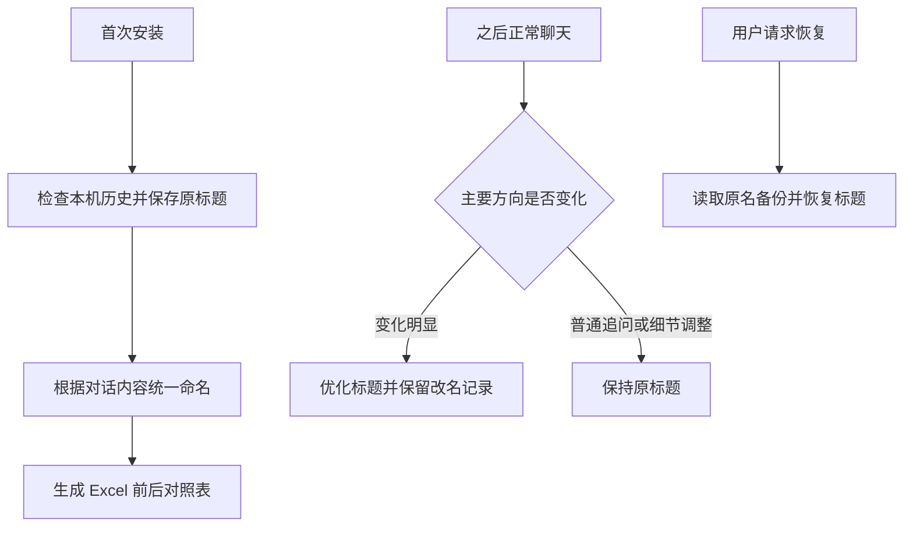

# Codex-Titles-Clean

**看一眼标题，就知道这个 Codex 对话在做什么。**

简体中文 · [English](README.en.md)

[](LICENSE)   [](https://github.com/JASONWONG1124/Codex-Titles-Clean/stargazers)

对话越来越多，Codex 自动生成的标题却格式不一、重点模糊；聊到后来，标题还可能停留在最初的话题。
想找回之前做过的事情，只能逐条点开确认。

**Codex-Titles-Clean 帮你整理旧标题，也在后续聊天中持续维护，让历史任务更容易辨认和查找。**

## 它能帮你做什么

- **全部旧对话，一次统一命名。** 首次安装后自动检查本机可访问的 Codex 历史任务，包括归档，结合对话内容统一整理标题。无需逐条打开、手动改名。
- **改了什么，一张 Excel 看清楚。** 整理结束后自动生成对照表，列出每个任务的 ID、原标题、优化后标题和处理结果，方便核对和留存。
- **聊到新方向，标题也会更新。** 正常聊天时自动检查主要方向；从讨论方案转为实际制作、从一个目标转向另一个目标时，再优化标题。普通追问和细节调整保持稳定。
- **原标题有备份，需要时可以恢复。** 改名前保存原名。安装后可以在 Codex 中 `@` 本插件，让它恢复当前任务或首次历史整理前的标题。

整理后的格式：

```text
简短对象丨两字分类丨具体主题

PPT丨讨论丨演示的信息密度
PPT丨创作丨用户感受主题课件
Codex丨开发丨对话标题自动整理
```

分类固定两个汉字，种类按内容决定：创作、讨论、教研、设计、排障……不限定在几种用途里。


*示例数据展示命名效果；插件修改标题文字，保留 Codex 原有侧栏布局。*

[开始安装](#安装) · [备份与恢复](#备份与恢复) · [运行原理](#运行原理) · [完整项目清单](#项目文件)

## 安装

适用于 **macOS**。需要 **Python 3.9+** 和已登录、支持插件与 Hooks 的 **Codex 桌面版**。
首次历史命名需要网络连接，并使用你的 Codex 模型额度；生成 Excel 不需要安装 Excel 软件。

**推荐使用下面两种方式，不必自己输入安装命令。** 先 [下载源码](https://github.com/JASONWONG1124/Codex-Titles-Clean/archive/refs/heads/main.zip) 并解压。

### 方式一：让 Codex 自动安装（推荐）

把解压后的**文件夹路径**发给 Codex，复制下面这段话即可：

```text
请帮我安装 Codex-Titles-Clean 插件，源码文件夹在：<粘贴文件夹路径>。
请运行安装脚本，完成历史标题整理，把 Excel 对照表给我，
并检查插件和后续自动检查是否已经启用。
```

Codex 会代你运行安装流程、查看处理结果；有需要你操作的地方，也可以让它说明。

### 方式二：双击脚本，一键开始安装（推荐）

打开解压后的文件夹，双击 **`install.command`**，按窗口提示操作。

脚本会依次完成：**安装插件 → 备份原标题 → 整理历史任务 → 导出 Excel 对照表**。
历史较多时，请等待窗口显示最终结果；无法读取或未能修改的任务也会在报告中列出。

### 方式三：使用命令安装

<details>
<summary>熟悉终端的用户可以展开查看</summary>

```bash
git clone https://github.com/JASONWONG1124/Codex-Titles-Clean.git
cd Codex-Titles-Clean
python3 scripts/install_plugin.py
```

如果已经下载并解压源码，在该文件夹内运行最后一条命令即可。

</details>

**首次开启聊天中的自动检查：** 在 Codex **设置 → Hooks** 中审阅并信任本插件的 UserPromptSubmit Hook，
再到插件页确认 **Codex-Titles-Clean** 已启用。新建一个任务即可开始使用。
安装脚本会自动整理旧历史；Hook 信任需要单独完成。

**更新插件后，请在方便时重启 Codex，载入最新的自动检查。** 标题检查出错会跳过本次命名，正常聊天继续。

从旧版 `sidebar-titles` 升级时，确认新版安装成功后卸载旧插件，避免重复检查；原标题记录会保留。

## 装好后，照常聊天就行

后续无需每次手动调用插件。主要方向变化时，它会在本轮回复结束前检查并更新标题。
例如，同一个任务从讨论 PPT 信息密度转为制作课程课件：

```text
PPT丨讨论丨演示的信息密度
          ↓ 开始制作课件
PPT丨创作丨用户感受主题课件
```

第一次历史整理结束后，你会得到这样的 Excel 对照表：

| 对话 ID | 原标题 | 优化后标题 | 处理结果 |
| :-- | :-- | :-- | :-- |
| 示例任务 A | 制作课件 | PPT丨创作丨用户感受主题课件 | 已更新 |
| 示例任务 B | 讨论 PPT 的信息密度设计 | PPT丨讨论丨演示的信息密度 | 已更新 |

*这里只展示部分列。实际报告还包含归档状态和说明，并保留跳过、冲突、失败等项目，便于逐条核对。*

想查看进度、重新取得报告或单独整理一批任务，在输入框中 `@` 并选择 **Codex-Titles-Clean**，直接告诉它：

```text
查看历史标题整理是否完成，把 Excel 对照表给我。
整理最近 20 条任务的标题，并给我对照报告。
```

历史整理和主动要求的批量整理结束后会生成报告；普通聊天不会每轮都产生一个 Excel 附件。

## 备份与恢复

**整理前的原标题会保存在本机。** 首次历史整理有一份原名快照，后续自动改名也保留任务首次接管时的原名。
这份备份用于恢复标题；任务里的聊天内容不会被清洗或改写。

在 Codex 输入框中 `@` 并选择 **Codex-Titles-Clean**，按需要告诉它：

| 你想做什么 | 直接这样说 |
| :-- | :-- |
| 撤销首次全量整理 | 恢复首次历史整理前的标题。 |
| 恢复当前任务原名 | 恢复当前任务接管前的原标题。 |
| 固定一个喜欢的标题 | 锁定当前标题，以后不要自动修改。 |
| 重新开启自动命名 | 解锁当前标题，继续自动整理。 |

全量恢复会跳过整理后已变化的标题；恢复当前任务则使用插件首次接管前保存的原名。
成功恢复的任务会锁定，直到你要求解锁。
原标题备份和报告保存在本机，卸载插件会保留这些记录；需要恢复时，请保留本地备份。

## 运行原理

**Skill 告诉 Codex 如何判断标题，Hook 在聊天过程中触发检查，脚本负责备份、改名、导出和恢复。**
首次整理会读取历史任务的开头和近期消息片段；日常检查由当前任务的模型完成。



## 项目文件

<details>
<summary>展开查看完整项目清单</summary>

```text
Codex-Titles-Clean/
├── .codex-plugin/  # 插件身份
│   └── plugin.json
├── assets/  # 效果示意图
│   └── title-comparison.svg
├── hooks/  # 自动检查触发点
│   └── hooks.json
├── scripts/  # 安装、命名、备份与报告
│   ├── vendor/
│   │   ├── create_basic_plugin.py
│   │   ├── identifier_validation.py
│   │   ├── LICENSE
│   │   ├── NOTICE
│   │   ├── read_marketplace_name.py
│   │   └── README.md
│   ├── app_server.py
│   ├── history_backfill.py
│   ├── install_plugin.py
│   ├── title_hook.py
│   ├── title_manager.py
│   └── title_report.py
├── skills/  # 命名与恢复指引
│   └── codex-titles-clean/
│       ├── references/
│       │   └── naming.md
│       └── SKILL.md
├── tests/  # 自动化测试
│   ├── test_archived.py
│   ├── test_backfill.py
│   ├── test_compatibility.py
│   ├── test_hook_safety.py
│   ├── test_hooks.py
│   ├── test_installer.py
│   ├── test_manager.py
│   ├── test_real_upgrade.py
│   ├── test_report.py
│   └── test_report_workflow.py
├── .gitignore  # 排除本地记录和报告
├── CHANGELOG.md  # 更新记录
├── install.command  # 双击安装入口
├── LICENSE  # MIT 许可证
├── README.en.md  # English documentation
└── README.md  # 中文说明
```

</details>

## MIT 开源许可

本项目采用 [MIT License](LICENSE)。欢迎使用、修改和分享。
随附的官方辅助脚本保留其 [上游许可](scripts/vendor/README.md)。
