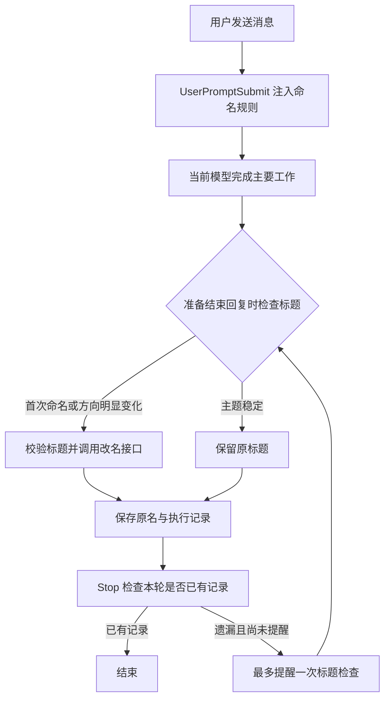

# Codex-Titles-Clean

**让你从一长列 Codex 对话中，看出每一条在做什么。**

Codex-Titles-Clean 是一个本地 Codex 插件，把任务标题统一为 `简短对象丨两字分类丨具体主题`。
首次安装会整理已有历史任务，包括归档；以后正常聊天，主要方向明显变化时再更新标题。


*上图使用示例数据展示命名效果，并非真实界面截图。插件修改标题文字，不改变侧栏的字号、颜色或布局。*

## 目录

- [特性](#特性)
- [安装与快速上手](#安装与快速上手)
- [日常使用与历史恢复](#日常使用与历史恢复)
- [Excel 对照报告](#excel-对照报告)
- [运行原理](#运行原理)
- [配置与数据保存](#配置与数据保存)
- [常见问题与排障](#常见问题与排障)
- [开发与许可](#开发与许可)

## 特性

- **按内容命名**：第一段尽量短，分类固定两个汉字但种类开放，最后一段保留具体问题或成果。
- **整理已有历史**：读取本机可访问的任务内容，分批命名，记录无法读取、冲突和跳过的任务。
- **保持标题稳定**：主要目标变化时更新；普通追问、局部修改和短暂插问通常保留原名。
- **保留恢复记录**：保存原标题和改名结果；接管后检测到手动改名，会保留并锁定该任务。
- **提供 Excel 对照表**：历史整理和明确执行的批量整理结束后，自动输出逐条处理结果。

例如，讨论 PPT 信息密度的任务可以叫 `PPT丨讨论丨演示的信息密度`；
开始实际制作课程课件后，可以变为 `PPT丨创作丨用户感受主题课件`。
分类可以使用创作、讨论、教研、设计、排障等词，含义相同的类别尽量沿用。

## 安装与快速上手

### 环境要求

- **macOS**，以及 **Python 3.9 或更新版本**。
- 本机已安装、已登录且支持插件和 Hooks 的 **Codex 桌面版**。
- 可用的 Codex 模型额度和网络连接，用于首次历史命名。

插件在本机 Codex 环境中运行，不能仅上传到普通 ChatGPT 网页聊天后使用。
Python 脚本及 Excel 导出使用标准库，无需额外安装 pip 依赖，也无需安装 Excel 才能生成报告。

### 安装

从 GitHub 获取源码，在插件根目录运行安装器：

```bash
git clone https://github.com/JASONWONG1124/Codex-Titles-Clean.git
cd Codex-Titles-Clean
python3 scripts/install_plugin.py
```

如果已经取得完整源码文件夹，进入该目录后只需运行最后一条命令。

也可以双击目录中的 `install.command`，或把完整文件夹交给 Codex，要求它安装并验证。

GitHub 仓库名为 `Codex-Titles-Clean`；安装器使用小写机器名 `codex-titles-clean`，
将插件复制到 `~/plugins/codex-titles-clean`，登记个人插件市场并调用 Codex 安装，
随后执行首次历史整理、保存原名并生成 Excel 报告。
已有源码版本会先完整备份；安装、历史整理或报告导出失败时，会分别报告，支持继续处理。
**请查看最终处理数量和报告结果，安装命令成功不代表每条历史都已改名。**

### 启用自动检查

1. 在 Codex **设置 → Hooks** 中，审阅并信任本插件的 `UserPromptSubmit` 和 `Stop`。
   安装器不会替你修改 Hook 信任设置；已经信任的定义无需重复操作。
2. 在 **设置 → Plugins（插件）→ Plugins** 确认「Codex-Titles-Clean」已安装且启用。
3. 新建一个任务，正常描述要做的工作。完成一轮回复后，查看侧栏标题；
   继续补充细节时标题应保持稳定，主要用途改变后才需要更新。

如果此前安装过 `sidebar-titles`，确认新插件安装成功后，请在插件管理中卸载旧插件，避免两个插件重复检查；恢复记录会保留，安装器不会自动卸载旧名称。

历史整理无需逐条打开旧任务。通过 Codex 原生插件界面安装时，首次历史整理会在
信任 Hooks 后首次发送消息时触发；上面的安装器会在安装过程中直接执行这一步。

## 日常使用与历史恢复

可以直接在 Codex 中说：

```text
查看首次历史整理是否完成。
整理最近 20 条任务的标题，并给我对照报告。
恢复当前任务原来的标题。
锁定当前标题。
解锁后继续自动整理。
```

命令行操作均在插件根目录运行：

| 目的 | 命令 |
| :-- | :-- |
| 查看历史整理数量、问题和报告位置 | `python3 scripts/history_backfill.py status` |
| 首次整理，或从中断处继续 | `python3 scripts/history_backfill.py run --automatic` |
| 恢复首次历史整理前的标题 | `python3 scripts/history_backfill.py restore` |
| 查看某条任务的改名记录 | `python3 scripts/title_manager.py --thread-id TASK_ID history` |
| 恢复某条任务首次接管前的标题 | `python3 scripts/title_manager.py --thread-id TASK_ID restore` |
| 暂停或恢复某条任务的自动改名 | `python3 scripts/title_manager.py --thread-id TASK_ID lock` / `unlock` |

将 `TASK_ID` 换成实际任务 ID。首次历史整理完成后，重复 `run` 不会重新覆盖全部任务。
全量恢复会停止这次历史迁移的后续自动续跑；成功恢复的任务会锁定，解锁后才继续自动命名。
期间发生的外部改名冲突会保留并列出，不强行覆盖。

首次接管前，插件无法判断旧标题是手写还是自动生成，因此首次整理会在备份后处理它。
原先没有自定义标题的任务，恢复为原预览文字；当前接口不能把自定义标题字段清回空值。

**停用或卸载**：在插件管理页关闭开关，或选择 `⋯ → Uninstall`。
卸载保留已经修改的标题、源文件夹和恢复记录；需要撤销标题时，先恢复再卸载。

## Excel 对照报告

首次历史整理、续跑、历史计划执行和历史恢复结束后，会自动生成或更新：

```text
<状态目录>/history-migration/reports/title-changes.xlsx
```

新安装的默认状态目录为 `~/.codex/codex-titles-clean`；从旧版升级时可能沿用旧目录，
用 `history_backfill.py status` 确认实际路径。报告位置以命令返回的 `report.path` 为准。
报告前六列为：

| 对话ID | 原标题 | 优化后标题 | 处理结果 | 归档状态 | 说明 |
| :-- | :-- | :-- | :-- | :-- | :-- |
| 示例任务 ID | 制作课件 | PPT丨创作丨用户感受主题课件 | 已更新 | 未归档 | 根据主要交付内容命名 |

成功、保留、跳过、锁定、冲突、失败和待处理项都会逐行列出。
**失败或冲突项不会把候选标题填成已成功修改的标题。**
报告反映这次执行记录，不是对侧栏状态的实时监控。

只想重新导出报告，无需再次命名：

```bash
python3 scripts/history_backfill.py report --output ./title-changes.xlsx
```

这条命令从已有快照和执行记录重建表格，不调用模型，也不修改标题。
报告导出失败会单独返回错误；修正输出路径或权限后，可以用它重试。

用户明确要求的其他批量整理也会自动导出 Excel，并保存可重建的 JSON 记录，位置为
`<状态目录>/reports/batch-时间-随机标识.xlsx`。
通过 `title_manager.py batch --plan plan.json --apply` 执行时，返回值包含 `results`、`counts` 和 `report`。
需要重导某次批量报告时，使用返回的 `report.source_path`：

```bash
python3 scripts/title_report.py --source ./batch-record.json --output ./batch-report.xlsx
```

日常单条任务的自动检查不会每轮生成一个附件；历史批量报告也不包含安装后所有单条自动改名。

## 运行原理

插件由 Codex 加载。日常检查使用当前任务的模型判断内容，脚本负责格式校验、执行与记录。
核心命名规则会随 Hook 注入本轮上下文，Skill 提供更详细的判断规则和手动操作说明。



检查失败不会持续阻塞主要任务；已锁定任务和子代理工作记录会跳过。
历史整理另走批处理：枚举未归档与归档任务，读取开头和近期消息片段，
使用当前 Codex CLI 配置的默认模型分批命名，再执行、验证和生成报告。
这些临时模型工作进程会额外使用账户额度，不新增侧栏任务。

| 文件 | 职责 |
| :-- | :-- |
| [插件声明](.codex-plugin/plugin.json) | 定义插件身份、版本与 Skill 入口 |
| [命名 Skill](skills/codex-titles-clean/SKILL.md) | 命名原则、详细判断和手动操作 |
| [Hook 定义](hooks/hooks.json) | 声明消息提交和回复结束时的触发点 |
| [title_hook.py](scripts/title_hook.py) | 注入规则，记录本轮检查，遗漏时提醒一次 |
| [title_manager.py](scripts/title_manager.py) | 校验、改名、冲突检查、锁定与恢复 |
| [history_backfill.py](scripts/history_backfill.py) | 历史快照、模型批处理、续跑和批量恢复 |
| [title_report.py](scripts/title_report.py) | 根据执行记录生成 Excel |
| [app_server.py](scripts/app_server.py) | 调用 Codex app-server 接口 |

标题写入使用 Codex 接口，不直接修改其数据库。
归档任务改名时会暂时取消归档，改名后恢复归档；中断时保存待恢复记录，以便续跑。

## 配置与数据保存

通常无需配置。需要指定运行环境时，可使用以下环境变量：

| 环境变量 | 默认行为 | 用途 |
| :-- | :-- | :-- |
| `CODEX_TITLES_CLEAN_STATE_DIR` | 未设置 | 直接指定本插件的状态根目录，优先级最高 |
| `CODEX_HOME` | `~/.codex` | Codex 数据根目录；新安装默认使用其下的 `codex-titles-clean` |
| `CODEX_TITLES_CLEAN_CODEX` | 自动查找 | 显式指定兼容的 Codex 可执行文件，优先级最高 |
| `CODEX_CLI_PATH` | 自动查找 | 未指定上一项时使用的 Codex 可执行文件路径 |

旧版的 `SIDEBAR_TITLES_STATE_DIR`、`SIDEBAR_TITLES_CODEX` 仍可使用；同时设置时，新变量优先。
没有显式指定状态目录时，若新的 `codex-titles-clean` 目录尚不存在、旧的 `sidebar-titles`
目录已存在，插件会沿用旧目录，保留原名备份和续跑进度。`history_backfill.py status`
会返回实际使用的状态路径；升级后不必手动搬动备份。

`CODEX_THREAD_ID` / `CODEX_SESSION_ID` 用于识别当前任务，由运行环境提供；
历史工作进程内部设置 `CODEX_TITLES_CLEAN_BACKFILL_WORKER` 防止递归触发，正常使用无需配置。
历史模型每批默认处理 20 条，可用 `run --batch-size 5` 调小，范围为 1–20。

本地状态包含原标题、改名记录、历史任务清单、经过基础脱敏的消息片段、计划和报告。
历史命名会把这些片段交给当前登录的 Codex 模型处理，不会复制或分析附件内容。
基础脱敏不能保证覆盖所有私密信息，**请勿把状态目录、个人报告或备份记录打包公开分享**。
分享插件时应保留源码中的隐藏 `.codex-plugin` 目录。

## 常见问题与排障

**只把 Skill 文件夹复制过去，可以用完整功能吗？**

完整插件需要声明文件、Hooks 和执行脚本一起安装。只装 Skill 不会自动注册 Hook。
缺少 `install.command` 时可以直接运行 Python 安装器；没有安装器时，Codex 也能按本地插件流程
登记并安装完整源码，但仍须验证启用状态、Hook 信任和首次历史整理结果。

**全部历史具体包括哪些？**

包括当前本机 Codex 接口可列出的主任务及归档任务。
不包括已删除任务、子代理工作记录、其他电脑的本地记录和独立的 ChatGPT 云端聊天。
没有可读用户文本的任务会跳过，读取失败会保留错误，命名依据是开头和近期片段，并非完整附件或所有历史轮次。

**为什么不是每轮都换名字？**

标题用于长期查找，检查不等于改名。补充细节通常保留标题；主要目标、对象或交付成果变化才更新。
新任务尚未形成可恢复的默认标题时，自动检查可能等到下一轮再接管。

| 现象 | 处理方法 |
| :-- | :-- |
| 找不到 Python 或 Codex | 确认环境满足安装要求；非标准 Codex 路径可通过上述环境变量指定 |
| 插件安装了，但新任务不改名 | 检查插件启用状态和两个 Hook 的信任状态，再新建任务验证；同时检查该任务是否锁定 |
| 历史整理因额度、登录或网络问题中断 | 解决对应问题后重新运行 `history_backfill.py run --automatic`，从已有记录继续 |
| 状态显示已完成，但有未改名项 | 查看 `counts`、`issues` 和 Excel 中的跳过、锁定、冲突项；完成表示本次检查已结束，不等于全部改名 |
| 提示已有整理在运行 | 用 `status` 查看进度，等待正在运行的实例结束 |
| 提示尚未确认恢复归档 | 继续历史整理，使脚本完成待恢复步骤；不要据此宣称该项处理成功 |
| 标题已处理，但 Excel 导出失败 | 查看 `report.status` 与错误信息，修正路径或权限后使用 `report --output` 补导出 |
| 报告提示尚无历史快照 | 先执行首次历史整理；单条日常检查不会建立完整历史快照 |

## 开发与许可

修改后在插件根目录运行本地测试：

```bash
python3 -m unittest discover -s tests -v
```

测试使用临时目录和模拟接口，覆盖命名、恢复、归档、安装与报告导出；
调试时可通过 `CODEX_TITLES_CLEAN_STATE_DIR` 隔离状态。
修改安装版本后应按 Codex 本地插件更新流程更新版本并重新安装，再用新任务验证。
变更记录见 [CHANGELOG.md](CHANGELOG.md)。

**项目自身代码尚未指定许可证。** 后续需明确授权范围并添加顶层 `LICENSE`，目前不声明采用 MIT、Apache-2.0 或其他开源许可证。

`scripts/vendor` 中的官方辅助脚本遵循上游 Apache-2.0，来源和许可见 [第三方代码说明](scripts/vendor/README.md)；该许可不代表项目其余代码的许可。
